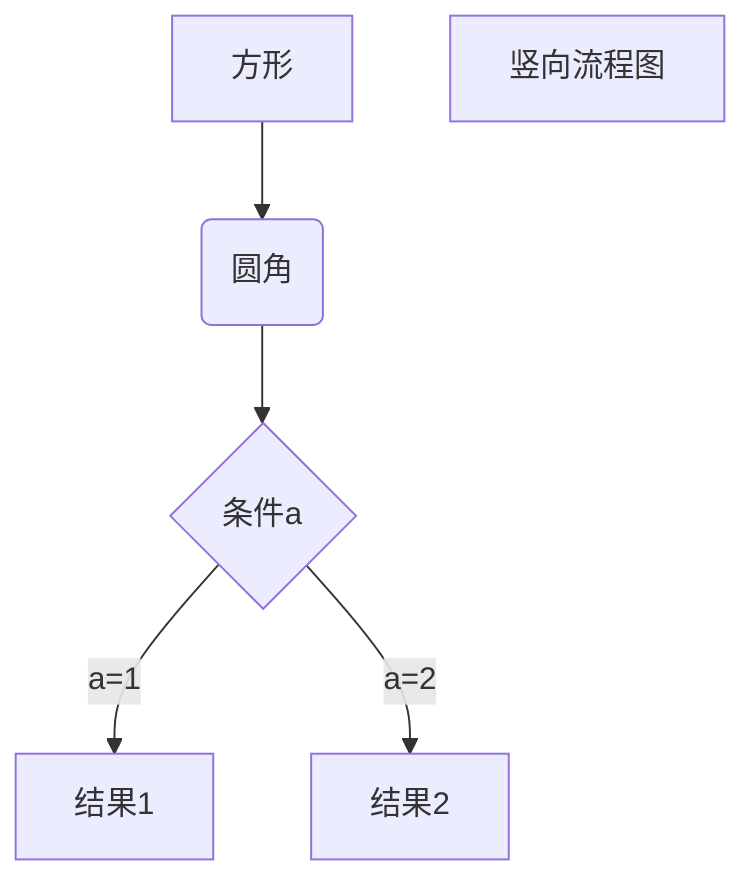

### 什么是 Markdown  
 
Markdown是一种轻量级标记语言，它以纯文本形式(易读、易写、易更改)编写文档，并最终以HTML格式发布。
    
Markdown也可以理解为将以MARKDOWN语法编写的语言转换成HTML内容的工具。
   
很多产品的文档也是用markdown编写的，并且以.MD或者.markdown后缀的文件保存在项目的目录下。   

    Markdown is a way to style text on the web. You control the display of the document; 
    formatting words as bold or italic, adding images, and creating lists are just a few of the things we can do with Markdown.
    Mostly, Markdown is just regular text with a few non-alphabetic characters thrown in, like # or *.                         
 
### [Markdown官方介绍](https://guides.github.com/features/mastering-markdown/)
官方地址：https://guides.github.com/features/mastering-markdown/

### Examples  

#### 1.段落 : 段落之间空一行  

#### 2.换行符 : 一行结束时输入两个空格                 

#### 3.画平行线：三个或者三个以上的 - 或者 * 都可以。  
***
*****

#### 4.字体加粗：  
**bold**

#### 5.字体倾斜：   
*italic*

#### 6.字体倾斜和加粗：  
***bold&italic***

#### 7.链接Links：  
[link to Google!](http://google.com)

#### 8.删除线Strikethrough:  
~~this~~

#### 9.文字大小：  
****
# This is an h1 tag
## This is an h2 tag
###### This is an h6 tag 
****

#### 10.无序列表Unordered Lists：无序列表用 - + * 任何一种都可以  
* Item 1
* Item 2
   * Item 2a
   * Item 2b
  
#### 11.有序列表Ordered Lists:数字加点   列表嵌套:上一级和下一级之间敲三个空格即可  
1. Item 1
1. Item 2
1. Item 3
   - Item 3a
   - Item 3b

#### 12.图片Images: 
  
Markdown 还没有办法指定图片的高度与宽度，如果你需要的话，你可以使用普通的  标签。  

#### 13.引用块Blockquotes:
> We're living the future so  
> the present is our past.  

> 野火烧不尽，春风吹又生。

引用也可以嵌套：  
> 这是引用的内容  
>> 这是引用的内容  
>>> 这是引用的内容

#### 14.内联代码Inline code:  代码之间分别用一个反引号包起来  符号''起到标记的作用  
内嵌代码`alert('Hello World');`  
I think you should use an `<addr>` element here instead.  
css 的大部分语法同样可以在 markdown 上使用，但不同的渲染器渲染出来的 markdown 内容样式也不一样，下面这些链接里面有 markdown 基本语法

支持的 HTML 元素有：`<kbd> <b> <i> <em>    `等:  
使用 <kbd>Ctrl</kbd> + <kbd>Alt</kbd> + <kbd>Del</kbd> 重启电脑

#### 15.Syntax highlighting:  
    Here’s an example of how you can use syntax highlighting with GitHub Flavored Markdown
    
    You can also simply indent your code by four spaces  
    
    Python code without syntax highlighting:
        
#### 16.任务清单Task Lists:  
- [x] @mentions, #refs, [links](), **formatting**, and <del>tags</del> supported
- [x] list syntax required (any unordered or ordered list supported)
- [x] this is a complete item
- [ ] this is an incomplete item

#### 17.表格Tables:  

First Header | Second Header
------------ | -------------
Content from cell 1 | Content from cell 2
Content in the first column | Content in the second column

可用符号- : 组合可设置对其方式:(注意表格上面要留一行)  

| 左对齐 | 右对齐 | 居中对齐 |
| :-----| ----: | :----: |
| 单元格 | 单元格 | 单元格 |
| 单元格 | 单元格 | 单元格 |

#### 18.Username @mentions:  
@mention

#### 19.表情符号Emoji:  
GitHub supports [emoji](https://help.github.com/en/github/writing-on-github/basic-writing-and-formatting-syntax#using-emoji)!  
To see a list of every image we support, check out the [Emoji Cheat Sheet](https://github.com/ikatyang/emoji-cheat-sheet/blob/master/README.md).  
表情实例 :stuck_out_tongue_winking_eye: :thinking: :joy: :smile:  （这里是github支持的md表情，但该博客上没有成功）  
原理还是字母和url键值对实现的，如 , 该表情url地址是https://github.githubassets.com/images/icons/emoji/unicode/1f914.png?v8  
[所有表情url地址](https://api.github.com/emojis)：https://api.github.com/emojis

#### 20.转义：
使用反斜杠转义特殊字符：  
**文本加粗**  
\*\* 正常显示星号 \*\*

#### 21.数学公式 :

$ J_\alpha(x) = \sum_{m=0}^\infty \frac{(-1)^m}{m! \Gamma (m + \alpha + 1)} {\left({ \frac{x}{2} }\right)}^{2m + \alpha} \text {，行内公式示例} $

线性代数  
$$
\mathbf{V}_1 \times \mathbf{V}_2 =  \begin{vmatrix} 
\mathbf{i} & \mathbf{j} & \mathbf{k} \\
\frac{\partial X}{\partial u} &  \frac{\partial Y}{\partial u} & 0 \\
\frac{\partial X}{\partial v} &  \frac{\partial Y}{\partial v} & 0 \\
\end{vmatrix}
$$

开方 $$\sqrt{2} \quad and \quad \sqrt[n]{3}$$

矢量 $$\vec{a} \cdot \vec{b}=0$$

详细可查看：https://www.zybuluo.com/codeep/note/163962

这里发现本博客,github,部分markDown软件无法显示markDown上的公式，Typora可正常显示  
google浏览器中安装插件https://chrome.google.com/webstore/detail/mathjax-plugin-for-github/ioemnmodlmafdkllaclgeombjnmnbima/related   插件名：MathJax Plugin for Github  注意：需要科学上网  

流程图也是，也就是说gitHub不能直接支持数学公式和流程图？这样的话 就需要Typora或者google插件显示出来后截图这样公式图片就有了，这样博客上的数学公式和流程图问题也间接解决了

Typora截图：  
  

#### 22.流程图:（注意上面也要留一空行）  

这里也没法显示，通过Typora截图如下

  

